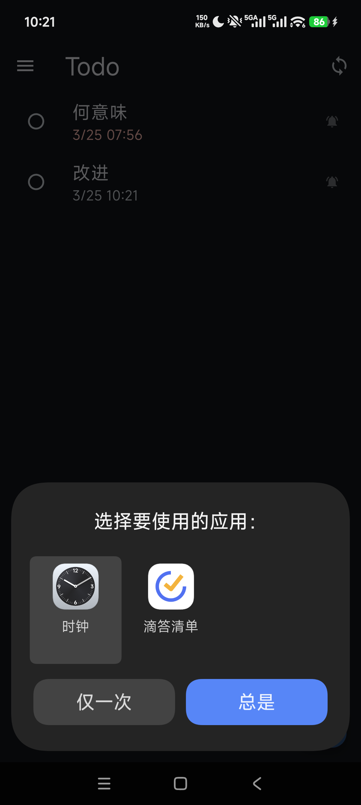
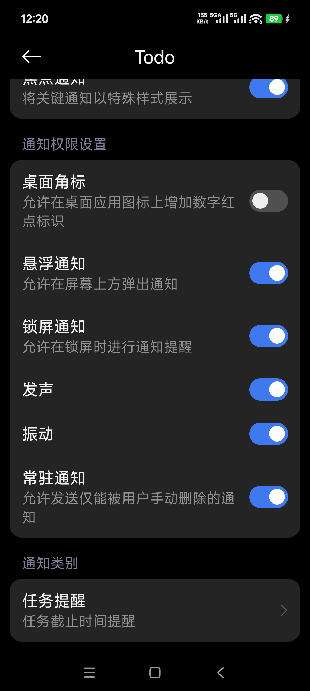
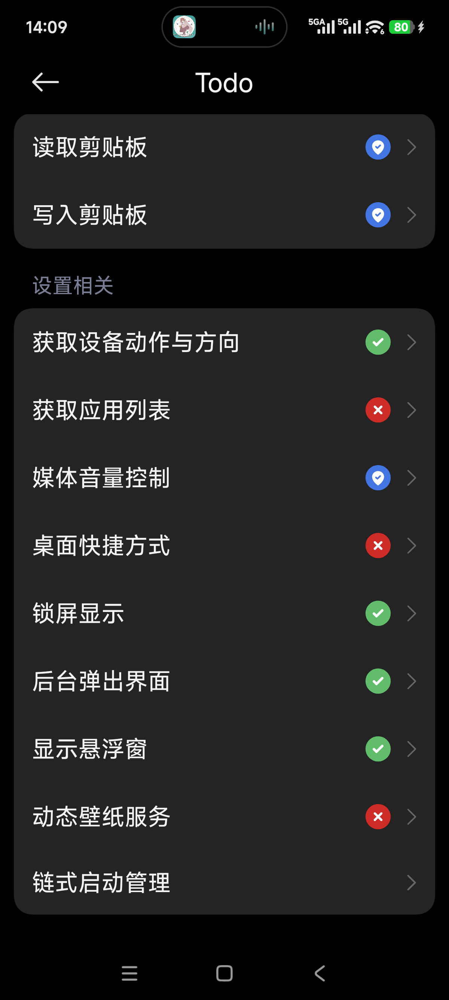

# Todo

极简跨平台 Todo + 心愿清单，通过 GitHub 仓库同步数据。

Android + Windows 双端，Flutter 构建。

## 功能

- **要做的**：带截止时间、提醒、重复的任务管理
- **想做的**：无时间压力的心愿池，思源宋体 + 暖色调
- **双向流动**：任务可降级为心愿，心愿可升级为任务
- **做过的合集**：已完成心愿按年份分组回顾
- **GitHub 同步**：通过 GitHub REST API 自动同步，支持冲突检测
- **Android 提醒**：AlarmManager + 前台 Service + 悬浮窗
- **Windows 桌面**：系统托盘、Toast 通知、开机自启、全局快捷键

## 构建

```bash
# Android
flutter build apk --release --target-platform android-arm64

# Windows
flutter build windows --release
```

## 配置 GitHub 同步

首次启动后在侧边栏 → GitHub 同步配置中填入：

- **Personal Access Token**：GitHub Settings → Developer settings → Personal access tokens → Fine-grained tokens，权限需要 Contents read/write
- **Owner**：你的 GitHub 用户名
- **Repo**：用于存放 todos.json 的仓库名（需要先创建）

配置保存在本地，不会上传。

## 截图

  
